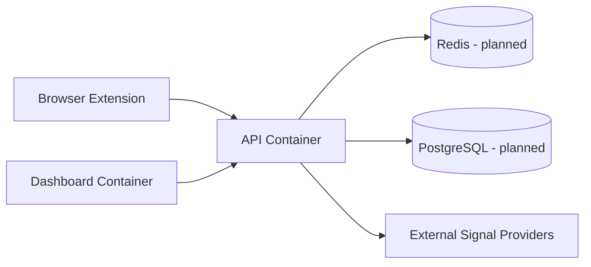
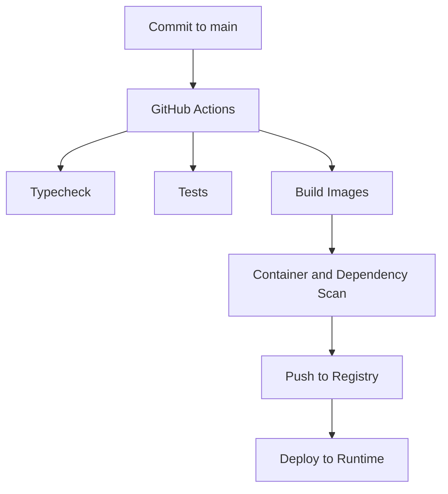

# Docker Life

Docker Life defines how TradeGuard Shield should be built, run, tested, and promoted through environments using containers.

## Local Development

```bash
pnpm install
docker compose -f infra/compose/dev.yml up --build
```

Services:

- API: `http://localhost:8080`
- Dashboard: `http://localhost:5173`

## Container Model



The current MVP runs with deterministic in-memory adapters. Production deployments should add PostgreSQL, Redis, a worker process, secret management, and observability.

## Image Responsibilities

### API Image

- Builds `@tradeguard/shared`
- Builds `@tradeguard/api`
- Exposes port `8080`
- Runs the Fastify server

### Dashboard Image

- Builds the React/Vite dashboard
- Exposes port `5173` for local development

## Environment Variables

```bash
API_PORT=8080
PUBLIC_API_BASE_URL=http://localhost:8080
FREE_RATE_LIMIT_PER_MINUTE=30
PRO_RATE_LIMIT_PER_MINUTE=600
GOOGLE_SAFE_BROWSING_API_KEY=
```

## Production Hardening Checklist

- Use immutable image tags.
- Run containers as non-root users.
- Store secrets outside the image.
- Add Redis-backed rate limiting.
- Add PostgreSQL persistence.
- Add OpenTelemetry traces and structured logs.
- Configure health checks and restart policies.
- Separate public API, worker, and admin dashboard networks.

## Release Flow


