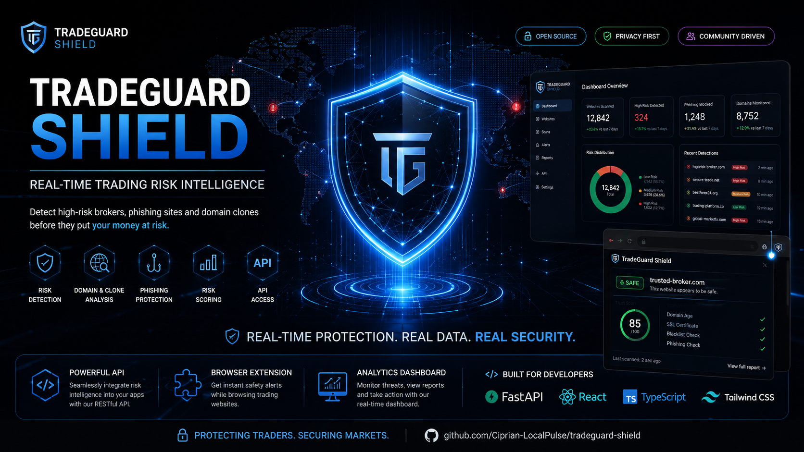

# TradeGuard Shield

<p align="center">
  
</p>

Real-time risk intelligence for trading websites: an API, browser extension, and dashboard that help users spot high-risk brokers, phishing clones, and suspicious trading platforms before they deposit money.


## Author and Copyright

Copyright (c) 2026 Ciprian Ștefan Pleșca. All rights reserved unless explicitly granted by the license in this repository.

## Why This Exists

Retail traders are often exposed to fake broker websites, clone domains, aggressive "guaranteed profit" campaigns, and phishing pages that look legitimate. TradeGuard Shield gives users a visible risk badge while browsing and returns evidence-backed explanations through an API.

The project is designed around explainable signals rather than unsupported accusations. Results are phrased as risk levels and supporting evidence, not legal determinations.

## Product Surface

- Browser extension with green, yellow, and red badges on visited trading websites.
- Public API for URL checks, reports, feedback, and aggregate statistics.
- Dashboard for analysts and operators to review recent checks and reports.
- Shared scoring package with transparent rule weights.
- Production-oriented config, security, logging, collector, worker, cache, and persistence boundaries.
- Docker Compose development environment.
- CI workflows for API, shared package, dashboard, and extension checks.

## Repository Layout

```text
tradeguard-shield/
  apps/
    api/                 Fastify API service
    dashboard/           React dashboard
    extension/           Manifest V3 browser extension
  packages/
    config/              Environment validation
    logger/              Redaction-safe log helpers
    security/            URL safety and security headers
    shared/              Types, URL normalization, scoring engine
    testing/             Shared fixtures
  services/
    collector/           Signal collection interfaces and timeout handling
    worker/              Background job primitives
  assets/                Branding, extension icons, diagrams
  docs/                  Architecture, API, legal, data-source notes
  infra/                 Docker and deployment assets
  .github/workflows/     CI
```

## Risk Levels

- `high`: 0-30, red badge
- `medium`: 31-60, yellow badge
- `low`: 61-100, green badge

## Quick Start

```bash
pnpm install
pnpm dev
```

API defaults to `http://localhost:8080`. Dashboard defaults to `http://localhost:5173`.

## API Example

```bash
curl "http://localhost:8080/api/v1/check?url=https://example-broker.com"
```

```json
{
  "domain": "example-broker.com",
  "score": 38,
  "riskLevel": "medium",
  "badge": "yellow",
  "reasons": [
    {
      "code": "DOMAIN_YOUNG",
      "severity": "warning",
      "detail": "Domain age is below the configured trust threshold."
    }
  ],
  "checkedAt": "2026-09-02T10:00:00.000Z",
  "cacheTtlSeconds": 86400
}
```

## Data Sources

The MVP ships with provider interfaces and deterministic local behavior so development is reliable without API keys. Production adapters can be added for:

- RDAP/WHOIS domain age and registration metadata
- Certificate Transparency history
- Google Safe Browsing or equivalent threat feeds
- PhishTank, OpenPhish, and local blocklists
- Financial regulators such as FCA, SEC, CySEC, ASIC, and ESMA
- Review and community feedback sources

## Monetization Model

- Free: basic checks, limited rate, current-site browser badge.
- Pro: detailed reports, watchlists, alerts, historical trend view, faster refresh.
- Enterprise/API: higher throughput, bulk checks, custom risk policies, audit exports.

## Legal And Ethical Position

TradeGuard Shield provides informational risk scoring. It does not declare a company guilty of fraud and does not replace financial, legal, or regulatory advice. Operators should provide appeal and correction workflows for site owners.

## Implementation Status

Implemented:

- TypeScript monorepo
- Fastify API with validation, security headers, request IDs, and SSRF guard
- Rule-based explainable scoring
- Manifest V3 extension with real icons and HTTP/HTTPS-only page matching
- Dashboard MVP
- Collector/worker interfaces
- Memory cache and persistence adapters
- PostgreSQL schema migration draft
- CI and security workflows

Planned before production:

- Real PostgreSQL adapter
- Real Redis adapter
- Authenticated dashboard
- External data-provider credentials and adapters
- Full regulator registry ingestion
- Independent scoring methodology review


