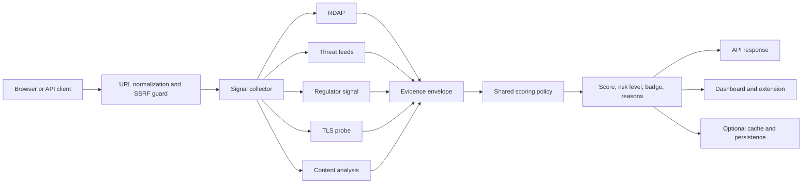

# TradeGuard Shield

<p align="center">
  
</p>

**TradeGuard Shield** is an explainable risk-intelligence system for trading websites. It combines a Fastify API, a browser extension, a dashboard, and a shared TypeScript scoring model to help users identify signals associated with phishing, impersonation, immature domains, insecure transport, and unverified trading claims before money is deposited.

> This repository is an independent research and engineering project. It produces evidence-oriented risk indicators, not legal, financial, regulatory, or fraud determinations.

## Abstract

TradeGuard Shield studies whether heterogeneous, low-cost web signals can be composed into a transparent and operationally safe domain-risk assessment. The current system collects five signal families, applies bounded rule-based scoring, stores optional operational feedback, and exposes the result to both machine and human clients. The design prioritises reproducibility, explicit uncertainty, source attribution, fail-neutral behaviour, and protection against server-side request forgery.

The system is currently at **v0.4.0**: the core API, scoring pipeline, browser-extension surface, dashboard, RDAP integration, OpenPhish cache, optional Google Safe Browsing integration, TLS probe, PostgreSQL/Redis adapters, and CI quality gates are implemented. Regulator data ingestion, large-scale calibration, independent evaluation, and production compliance remain open research and engineering work.

## Author and research profile

<p align="center">
  
</p>

**Ciprian Ștefan Pleșca** is an independent Romanian researcher and software developer, unaffiliated with an institution and working without dedicated institutional resources. TradeGuard Shield is developed as a self-directed public-interest research project.

Contact: [contact@agentflow-enterrprise.com](mailto:contact@agentflow-enterrprise.com)

See the full [author and research profile](docs/author.md).

## Research questions

1. Can public, explainable signals provide useful early warning without pretending to establish truth about a business?
2. How should an API behave when an upstream registry or threat feed is slow, unavailable, incomplete, or geographically biased?
3. Can evidence, uncertainty, feedback, and operational controls be represented in a small system that is auditable by independent reviewers?

## System model



The collector is deliberately fail-neutral: an upstream error yields an unknown or neutral signal rather than a synthetic positive or negative fact. This preserves availability while making uncertainty visible to callers and operators.

## Scoring interpretation

The shared package maps bounded signal evidence to a score from 0 to 100 and then to a risk level:

| Score | Level | Badge | Interpretation |
|---:|---|---|---|
| 0–30 | high | red | Multiple adverse indicators or a strong threat signal |
| 31–60 | medium | yellow | Material uncertainty or mixed evidence |
| 61–100 | low | green | No material adverse signal observed by the configured providers |

“Low risk” means only that the configured checks did not find a material indicator at that time. It is not an endorsement, solvency opinion, or guarantee of safety.

## Signal and evidence pipeline

```mermaid
sequenceDiagram
  participant Client
  participant API as Fastify API
  participant Signals as Signal orchestrator
  participant RDAP as RDAP registry
  participant Feeds as OpenPhish / Safe Browsing
  participant Score as Shared scorer

  Client->>API: GET /api/v1/check?url=...
  API->>Signals: validate and collect(domain)
  par bounded external calls
    Signals->>RDAP: domain lookup (3 s timeout)
    Signals->>Feeds: threat lookup (3 s timeout; feed cache 15 min)
  end
  Signals->>Score: typed evidence with unknowns preserved
  Score-->>API: score, level, badge, reasons
  API-->>Client: explainable JSON response
```

## Quick start

Requirements: Node.js 22.12 or newer, Corepack, and pnpm 9.9.

```bash
corepack enable
pnpm install
pnpm dev
```

The API defaults to `http://localhost:8080`; the dashboard defaults to `http://localhost:5173`.

For optional Google Safe Browsing checks, configure the key outside source control:

```bash
GOOGLE_SAFE_BROWSING_API_KEY=your-key pnpm --filter @tradeguard/api dev
```

The OpenPhish feed requires no key and is cached locally for at least 15 minutes. All external calls have an explicit maximum timeout of three seconds and degrade to neutral results.

## API example

```bash
curl "http://localhost:8080/api/v1/check?url=https://example-broker.com"
```

```json
{
  "domain": "example-broker.com",
  "score": 38,
  "riskLevel": "medium",
  "badge": "yellow",
  "reasons": [{
    "code": "DOMAIN_YOUNG",
    "severity": "warning",
    "detail": "Domain age is below the configured trust threshold."
  }],
  "checkedAt": "2026-09-02T10:00:00.000Z",
  "cacheTtlSeconds": 86400
}
```

See the [API reference](docs/api.md) and [OpenAPI notes](docs/api/openapi.md).

## Repository architecture

```text
apps/api/          Fastify HTTP API, orchestration, adapters, signal implementations
apps/dashboard/    React operator dashboard
apps/extension/    Manifest V3 browser extension
packages/shared/   Domain types, URL normalization, scoring policy
packages/config/   Environment validation and runtime configuration
services/          Collector and worker boundaries
docs/              Academic architecture, API, operations, ethics, and author profile
infra/             Docker and deployment assets
assets/            Branding, diagrams, and author media supplied by the author
```

## Integrated sources and limitations

| Source | Current use | Principal limitation |
|---|---|---|
| RDAP via `rdap.org` | Registration event and domain-age evidence | Registry coverage and fields vary by TLD; privacy detection is heuristic |
| OpenPhish public feed | Cached URL/domain threat matching | Public feed coverage and freshness are outside this project’s control |
| Google Safe Browsing v4 | Optional threat match query | Requires a Google Cloud API key and is subject to Google quotas/terms |
| TLS endpoint probe | HTTPS reachability and certificate authorisation | Network vantage point and transient outages can affect observations |
| Regulator mappings | Conservative signal layer | Current coverage is limited; it is not a complete or authoritative global register |

Read the full [data-source methodology](docs/data-sources.md) before interpreting a result.

## Current status and next phase

| Area | Status |
|---|---|
| Fastify API and typed contracts | Implemented and tested |
| Explainable scoring | Implemented; requires external calibration study |
| RDAP and threat feeds | Implemented with timeout and neutral-failure semantics |
| TLS probe | Implemented with bounded HTTPS request |
| Dashboard and extension surfaces | MVP implemented; further UX and deployment hardening remain |
| PostgreSQL and Redis adapters | Implemented; production backup/observability validation remains |
| Regulator ingestion | Limited/partial; not a complete global regulator database |
| Independent accuracy evaluation | Not yet completed |
| Regulatory/compliance certification | Not claimed |

The next phase is empirical validation: a documented evaluation set, precision/recall analysis, calibration of thresholds, source-specific coverage audits, disposable database integration tests, and an operational runbook tested under failure conditions. “Complete” for a safety-oriented product means measurable, reviewable operation—not merely that all files compile.

## Security, privacy, and ethics

TradeGuard Shield uses URL validation and SSRF protection, redaction-aware logging, bounded external requests, authenticated production dashboard routes, and explicit neutral fallbacks. Operators must preserve evidence, offer correction/appeal paths, and avoid presenting a risk score as an accusation. See [security](docs/security/ssrf.md), [legal and ethics](docs/legal-and-ethics.md), and [incident response](docs/operations/incident-response.md).

## Supporting the research

If you wish to support this independent work, please contact the author at [contact@agentflow-enterrprise.com](mailto:contact@agentflow-enterrprise.com). Donations should be voluntary and transparent; no payment address or financial account is embedded in the repository until the author publishes an official, verifiable donation channel.

## Documentation map

- [Author and research profile](docs/author.md)
- [Research methodology](docs/research-methodology.md)
- [Architecture](docs/architecture.md)
- [API reference](docs/api.md)
- [Data sources](docs/data-sources.md)
- [Development](docs/development.md)
- [Deployment](docs/deployment.md)
- [Legal and ethics](docs/legal-and-ethics.md)
- [Arabic project summary](docs/README.ar.md)
- [Changelog](CHANGELOG.md)

## License and citation

Copyright (c) 2026 Ciprian Ștefan Pleșca. See [LICENSE](LICENSE) and [NOTICE](NOTICE) for the repository terms. For academic or technical reuse, cite the repository and identify the exact release, configuration, data sources, and observation date.
