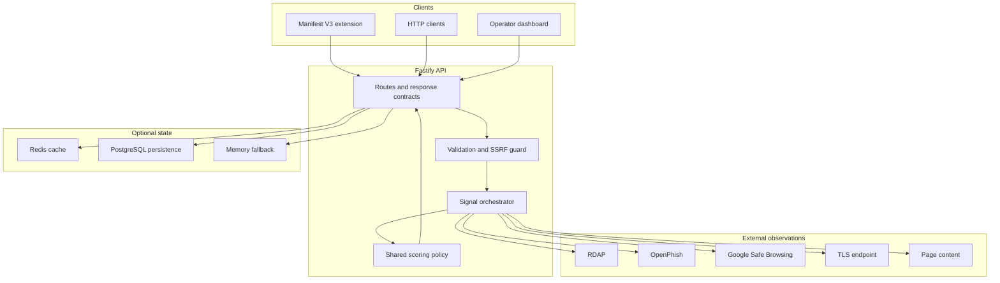

# System Architecture

## Architectural thesis

TradeGuard Shield is a layered, evidence-oriented system. Adapters observe external state; signal modules convert observations into typed evidence; the shared package applies a deterministic policy; clients display a bounded result.

## Request lifecycle

1. The API parses and normalises an HTTP(S) URL.
2. The SSRF guard rejects unsupported schemes, private targets, and unsafe redirects.
3. The orchestrator requests the five signal families with bounded external work.
4. Each signal returns typed evidence. Timeout and network failure produce neutral/unknown evidence.
5. `packages/shared` calculates a deterministic score, risk level, badge, and reason list.
6. The response is optionally cached and persisted according to the configured runtime adapters.

No signal is permitted to throw an upstream error into the request path. This invariant protects API availability and prevents a provider outage from becoming a fabricated finding.

## Data and trust boundaries

External responses are untrusted input. The API treats provider payloads as data, validates JSON shape, and never executes returned content. Logs must not contain API keys, full query URLs when they contain sensitive components, or page bodies.

## Persistence strategy

The runtime selects PostgreSQL and Redis when their connection URLs are configured. Memory adapters remain useful for local development and neutral degradation. See [persistence](architecture/persistence.md) for adapter contracts and operational assumptions.

## Failure semantics

| Failure | API behaviour | Interpretation |
|---|---|---|
| RDAP timeout | `domainAgeDays: undefined` | registration evidence unavailable |
| Threat-feed timeout | `listed: false` | no positive finding was obtained |
| Invalid provider payload | neutral signal | provider response rejected |
| Cache outage | bypass cache | availability takes priority |
| Persistence outage | request may continue with logging | result is not silently presented as durably stored |

Neutral does not mean safe. It means the system did not obtain sufficient evidence from that source.

## Evolution path

The next architectural phase is provider versioning, source-specific provenance, asynchronous refresh jobs, evidence snapshots with retention controls, disposable integration environments, and OpenTelemetry-compatible instrumentation.
