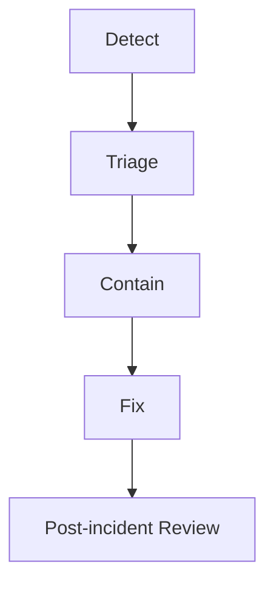

# Incident Response

## Severity Levels

- SEV1: scoring or extension issue could cause broad user harm.
- SEV2: API availability, data-source, or dashboard outage.
- SEV3: documentation, packaging, or low-impact operational issue.

## Response Flow

## Rules

- Do not publish sensitive report data.
- Preserve logs needed for investigation.
- Communicate uncertainty clearly.
