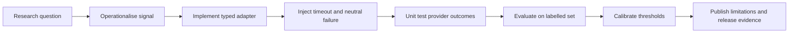

# Research Methodology

## Aim

The working hypothesis is that transparent combinations of weak public signals can improve early triage while remaining safer than opaque or categorical accusations.

## Method

The current release has completed implementation and unit-test stages for the core integrations. It has not completed a statistically defensible external accuracy evaluation, prospective monitoring study, or regulatory certification.

## Reproducibility requirements

An evaluation report should record the release tag, commit, environment, provider responses or hashes, timezone, cache state, API configuration, and the exact decision thresholds. Results must separate provider-unavailable cases from confirmed negative observations.

## Responsible interpretation

The system supports prioritisation for review. It should not be used as the sole basis for account closure, denial of financial access, publication of allegations, or regulatory action. Human review and an appeal/correction workflow remain necessary.
