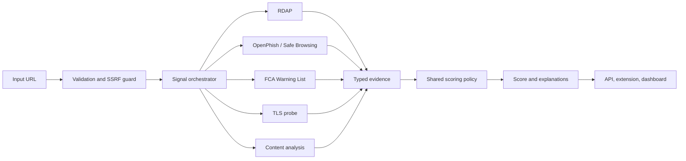

# TradeGuard Shield
## An Explainable, Fail-Neutral Framework for Risk Triage of Online Trading Domains

**Version:** 0.5.0 (research release)  
**Date:** 11 September 2026  
**Author:** Ciprian Ștefan Pleșca, independent Romanian researcher  
**Contact:** contact@agentflow-enterrprise.com

## Abstract

Online trading users increasingly encounter domains that imitate established
financial brands, advertise implausible returns, or request deposits through
high-risk channels. TradeGuard Shield investigates whether heterogeneous,
publicly accessible observations can be combined into a transparent risk-triage
instrument without presenting a probabilistic or heuristic result as a legal
finding.

The system combines domain registration metadata, public threat intelligence,
transport-security observations, page-content indicators, and limited regulator
warning data. A bounded rule policy transforms typed evidence into a score,
risk level, badge, and reason list. Provider failures are represented as
unknown or neutral evidence, rather than fabricated observations or request
failures. This release also introduces reusable binary-evaluation metrics for
future labelled datasets.

The contribution is architectural and methodological, not a claim of fraud
detection accuracy. No independent accuracy study, global regulator coverage,
or regulatory certification is claimed by this paper.

## 1. Research objective

The central question is:

> Can a small, reproducible system provide useful early warning from weak
> public signals while preserving uncertainty, source attribution, and a path
> for human correction?

The operational objectives are to:

1. collect evidence through explicit provider boundaries;
2. enforce timeouts and fail-neutral behaviour for external dependencies;
3. expose a deterministic and inspectable scoring policy;
4. support reproducible evaluation on a labelled sample;
5. avoid claims that exceed the coverage of the evidence.

## 2. System architecture



The implementation is a pnpm TypeScript monorepo. The API is built on
Fastify; shared types and scoring live in `packages/shared`; optional Redis,
PostgreSQL, and memory adapters provide operational state; the browser
extension and dashboard are separate clients.

## 3. Evidence model

The current signal families are:

| Signal | Observation | Neutral failure |
|---|---|---|
| RDAP | registration event, domain age, known privacy-proxy markers | undefined age, privacy false |
| OpenPhish | cached public phishing-feed match | listed false |
| Google Safe Browsing | optional v4 threat match | listed false when unavailable |
| TLS | HTTPS reachability and certificate authorisation | valid false |
| FCA Warning List | warning-feed domain match | no match |
| Content analysis | suspicious marketing-language indicators | empty claims |

Every external call is explicitly bounded to three seconds. OpenPhish and FCA
warning data are cached for fifteen minutes. The absence of a finding is not
treated as proof of legitimacy.

## 4. Scoring policy

The current policy starts from 100 and applies bounded penalties. The public
result is mapped to:

| Score | Risk level | Badge |
|---:|---|---|
| 0–30 | high | red |
| 31–60 | medium | yellow |
| 61–100 | low | green |

The policy is intentionally explainable: each penalty has a code, severity,
source, and human-readable detail. The current thresholds are engineering
defaults, not empirically calibrated probabilities.

## 5. Evaluation protocol

Version 0.5.0 adds `evaluateBinaryClassifier()` to the shared package. It
accepts an externally prepared labelled sample containing `actualHighRisk` and
`predictedHighRisk` values and returns:

- confusion-matrix counts;
- sample count;
- accuracy;
- precision;
- recall/sensitivity;
- specificity;
- F1 score.

```ts
import { evaluateBinaryClassifier } from "@tradeguard/shared";

const metrics = evaluateBinaryClassifier(labelledObservations);
console.log(metrics.precision, metrics.recall, metrics.f1);
```

No fabricated benchmark dataset is shipped with the project. A defensible
study must document sampling, labelling criteria, observation date, provider
availability, release commit, threshold configuration, and treatment of
unknown evidence. Results must include confidence intervals or an appropriate
uncertainty analysis before being used for consequential decisions.

## 6. Threat model and safety properties

The system treats URLs and provider payloads as untrusted input. The principal
threats are server-side request forgery, malicious or malformed provider data,
credential exposure, feed outages, false positives, false negatives, and
misuse of a heuristic score as an accusation.

The relevant safety properties are:

1. only public HTTP(S) targets pass URL validation;
2. external work has an explicit timeout;
3. provider failure does not create synthetic evidence;
4. API keys are read from environment configuration and are redacted from logs;
5. risk reasons identify their source family;
6. dashboards can be protected with an API key in production;
7. reports and feedback have separate persistence paths.

## 7. Limitations

RDAP fields vary by top-level domain and privacy detection is heuristic.
OpenPhish and Google Safe Browsing have provider-specific coverage, quotas,
terms, and freshness. The FCA Warning List is UK-focused and is not a global
authorisation registry. TLS observations depend on network vantage point.
Content analysis may miss rendered or multilingual content. A domain absent
from every feed may still be harmful, and a listed domain requires contextual
review.

The scoring policy has not undergone independent calibration, prospective
monitoring, external peer review, or regulatory certification. The system must
not be the sole basis for account closure, denial of financial access,
publication of allegations, or regulatory action.

## 8. Reproducibility and release state

The v0.5.0 research release includes the API, browser-extension surface,
dashboard, real provider integrations, OpenAPI contract, evaluation utility,
unit tests, type checking, builds, and automated CI/Security/CodeQL gates.

Reproduction requires Node.js 22.12 or newer, pnpm 9.9, the release commit,
the relevant environment variables, and a record of provider/cache state.
Operational PostgreSQL/Redis backup restoration, a labelled evaluation set,
global regulator expansion, and a production compliance review remain future
work.

## 9. Ethical position

TradeGuard Shield is an independent public-interest research project. It does
not declare a company fraudulent, licensed, trustworthy, solvent, or legally
compliant. Human review, correction, appeal, source verification, and careful
language are mandatory around any consequential use.

## 10. Conclusion

TradeGuard Shield demonstrates a practical architecture for explainable domain
risk triage under uncertain and failure-prone external data. Its principal
result is not a claim that the current score is universally accurate; it is a
reproducible boundary between observation, policy, and interpretation. The
next scientific step is an independent labelled evaluation with published
sampling and uncertainty methodology.

## Citation

> Pleșca, Ciprian Ștefan. *TradeGuard Shield: An Explainable, Fail-Neutral
> Framework for Risk Triage of Online Trading Domains*. Research release
> v0.5.0, 2026. https://github.com/Ciprian-LocalPulse/tradeguard-shield

## Source references

- [RDAP protocol, RFC 9083](https://www.rfc-editor.org/rfc/rfc9083)
- [Google Safe Browsing API documentation](https://developers.google.com/safe-browsing/v4)
- [FCA Warning List](https://www.fca.org.uk/consumers/warning-list-unauthorised-firms)
- [OpenPhish public feed](https://openphish.com/feed.txt)
