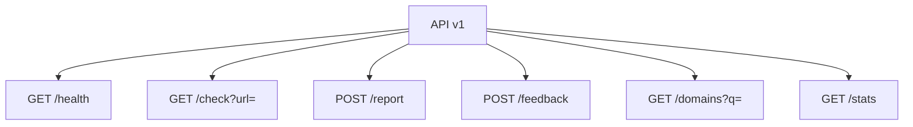

# API Reference

Base path: `/api/v1`

## Endpoints



## Check Response

```json
{
  "domain": "example-broker.com",
  "score": 38,
  "riskLevel": "medium",
  "badge": "yellow",
  "reasons": [
    {
      "code": "DOMAIN_YOUNG",
      "severity": "warning",
      "detail": "Domain age is below the configured trust threshold.",
      "source": "rdap"
    }
  ],
  "checkedAt": "2026-09-02T10:00:00.000Z",
  "cacheTtlSeconds": 86400
}
```
