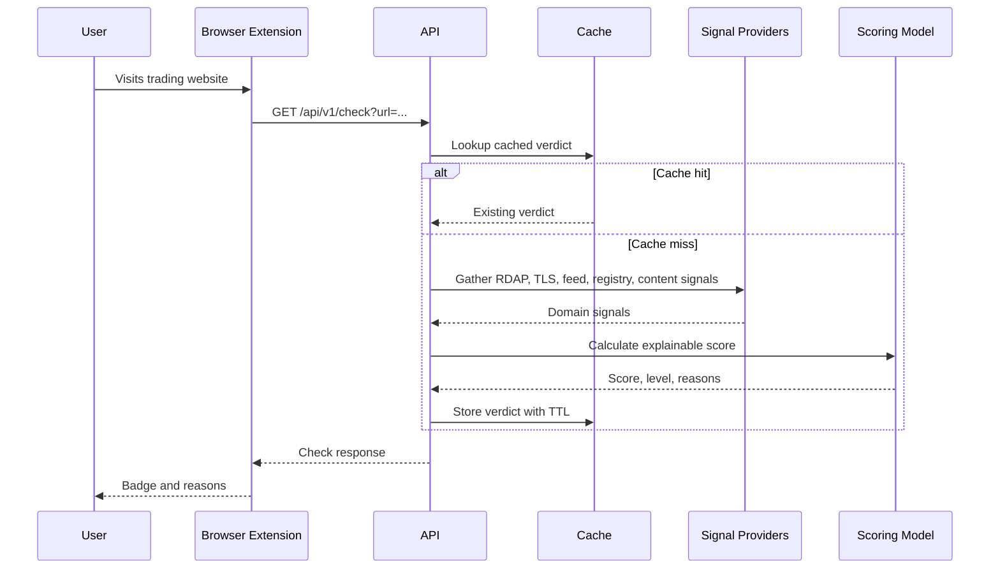
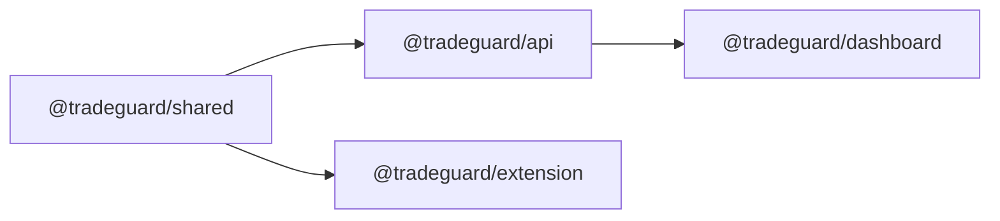
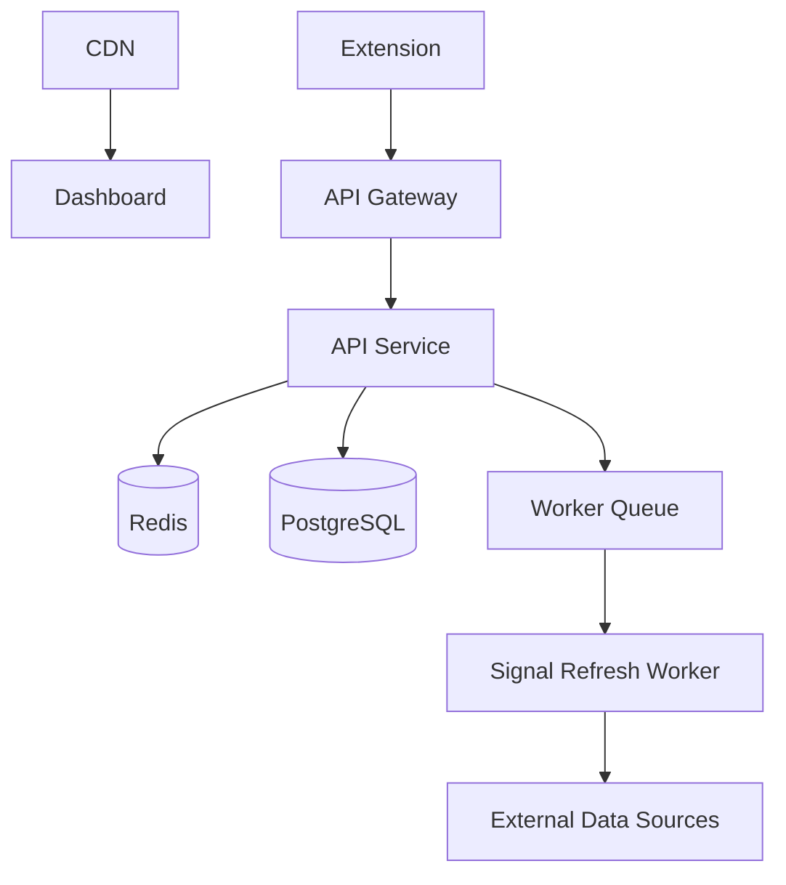

# Architecture

The architecture is modular so new data sources can be added without changing the extension or dashboard.

## Runtime Architecture

```mermaid
sequenceDiagram
  participant U as User
  participant E as Browser Extension
  participant A as API
  participant C as Cache
  participant S as Signal Providers
  participant M as Scoring Model

  U->>E: Visits trading website
  E->>A: GET /api/v1/check?url=...
  A->>C: Lookup cached verdict
  alt Cache hit
    C-->>A: Existing verdict
  else Cache miss
    A->>S: Gather RDAP, TLS, feed, registry, content signals
    S-->>A: Domain signals
    A->>M: Calculate explainable score
    M-->>A: Score, level, reasons
    A->>C: Store verdict with TTL
  end
  A-->>E: Check response
  E-->>U: Badge and reasons
```

## Package Boundaries

```mermaid
flowchart LR
  Shared["@tradeguard/shared"] --> API["@tradeguard/api"]
  Shared --> Extension["@tradeguard/extension"]
  API --> Dashboard["@tradeguard/dashboard"]
```

## Production Target

```mermaid
flowchart TB
  CDN[CDN] --> Dashboard
  Extension --> Gateway[API Gateway]
  Gateway --> API[API Service]
  API --> Redis[(Redis)]
  API --> Postgres[(PostgreSQL)]
  API --> Queue[Worker Queue]
  Queue --> Worker[Signal Refresh Worker]
  Worker --> External[External Data Sources]
```
