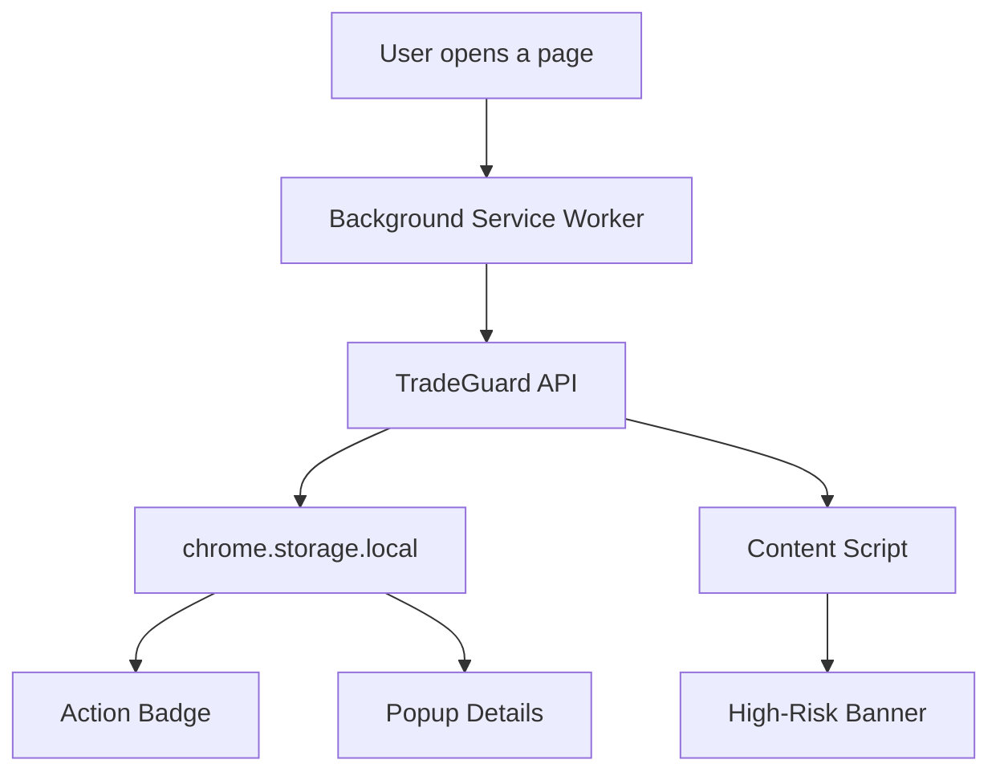

# Browser Extension

The extension is built on Manifest V3 and focuses on a minimal, useful interaction model.

## Extension Flow

## Permission Strategy

- `activeTab` for current-page context
- `tabs` to react to navigation changes
- `storage` for API base URL and check results
- Host permissions for API access and current URL checks

## User Interface

The extension exposes:

- Badge text and color
- Popup with score and reasons
- High-risk page banner
- Options page for API base URL
