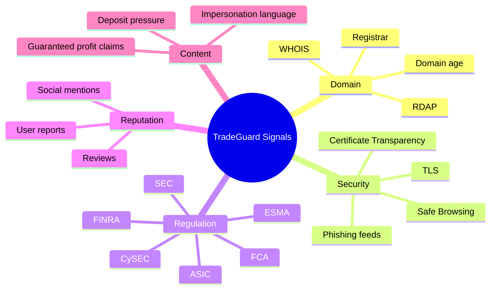

# Data Sources

The MVP uses deterministic mock adapters so the project is runnable without external credentials. Production deployments should replace those adapters with real integrations.

## Source Categories

## Evidence Quality

High-impact penalties should prefer official or reproducible sources. Community reports and reviews should influence prioritization but require careful weighting.
