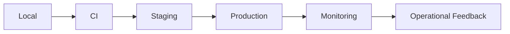

# Deployment

TradeGuard Shield can start as a small container deployment and evolve into a multi-service system.

## Local Docker

```bash
docker compose -f infra/docker-compose.yml up --build
```

## Environment Flow



## Recommended Production Services

- API service
- Dashboard service behind authentication
- Redis cache
- PostgreSQL database
- Worker for scheduled source refresh
- Observability stack
- Secret manager
