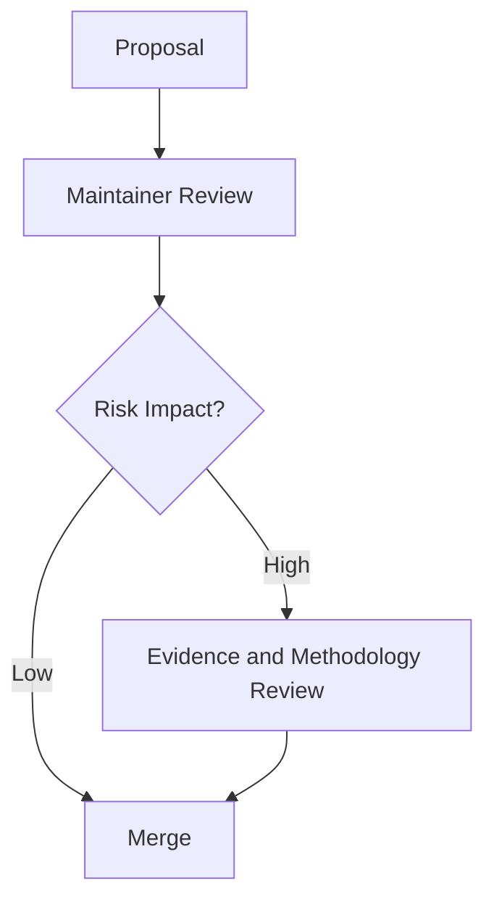

# Governance

TradeGuard Shield is authored by Ciprian Ștefan Pleșca and maintained as independent software.

## Technical Direction

Project direction is guided by:

- User safety
- Evidence quality
- Explainability
- Security
- Maintainability
- Legal and ethical care

## Contribution Expectations

Contributors should:

- Keep claims evidence-backed
- Avoid defamatory language
- Prefer transparent scoring changes
- Add tests for scoring or signal-provider changes
- Treat user reports and payment details as sensitive

## Decision Flow

