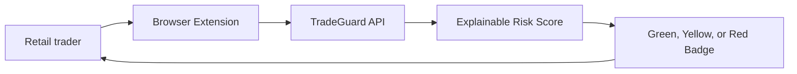

# TradeGuard Shield Wiki

Welcome to the professional wiki for TradeGuard Shield, a real-time API and browser extension for checking the legitimacy and risk level of trading websites.

## Wiki Index

- [System Overview](System-Overview.md)
- [Architecture](Architecture.md)
- [Scoring Model](Scoring-Model.md)
- [Data Sources](Data-Sources.md)
- [Browser Extension](Browser-Extension.md)
- [API Reference](API-Reference.md)
- [Deployment](Deployment.md)
- [Security Model](Security-Model.md)
- [Roadmap](Roadmap.md)
- [Governance](Governance.md)

## Mission

TradeGuard Shield helps users identify suspicious trading websites before they deposit money, submit identity documents, or connect wallets.

## Repository

- Author: Ciprian Ștefan Pleșca
- License: MIT
- Primary stack: TypeScript, Fastify, React, Manifest V3, Docker
