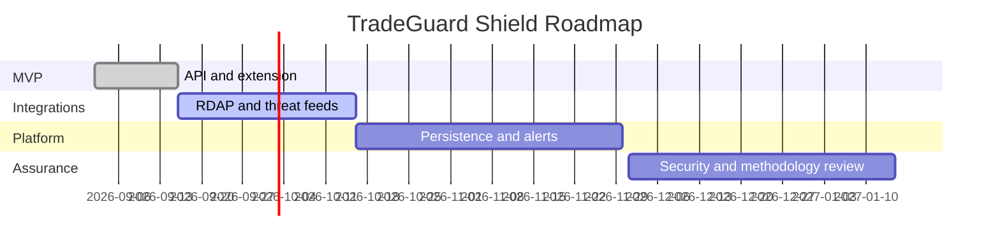

# Roadmap

## Stage 1 - MVP

- API check endpoint
- Manifest V3 extension
- Rule-based scoring
- Mock signal providers
- Basic dashboard

## Stage 2 - Real Integrations

- RDAP adapter
- Certificate Transparency adapter
- Threat-feed ingestion
- Initial regulator registry connectors

## Stage 3 - Persistence and Alerts

- PostgreSQL schema
- Redis cache
- User reports
- Watchlists
- Pro alerts

## Stage 4 - Methodology Review

- Labeled benchmark dataset
- Score calibration
- False-positive appeal workflow
- Independent scoring-methodology review

