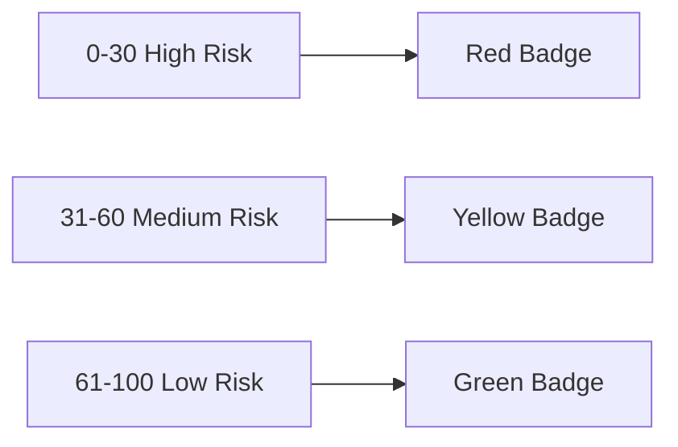
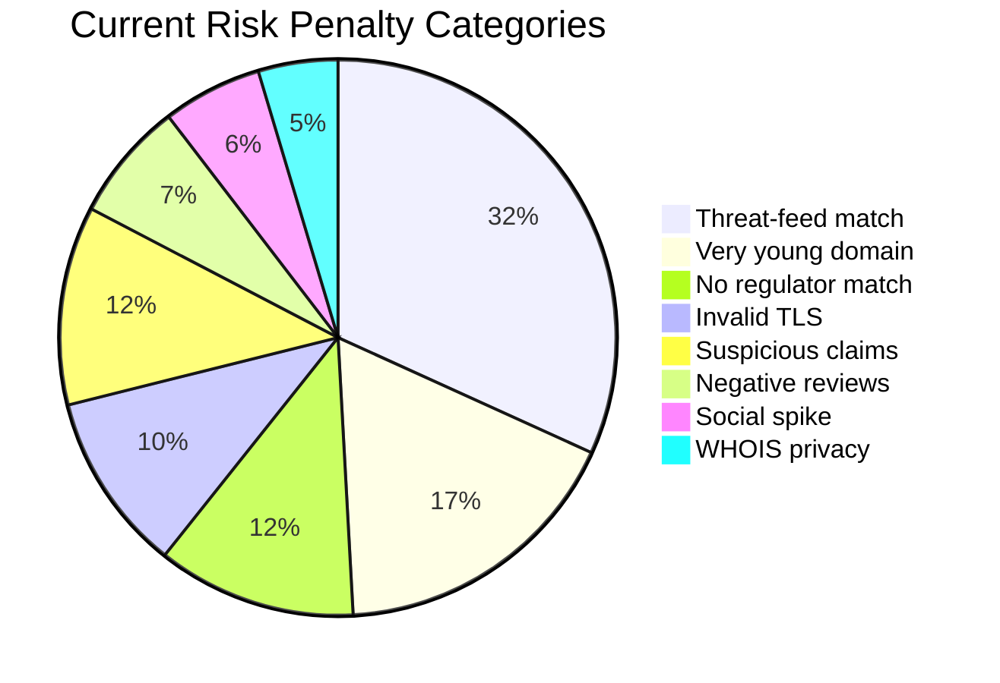
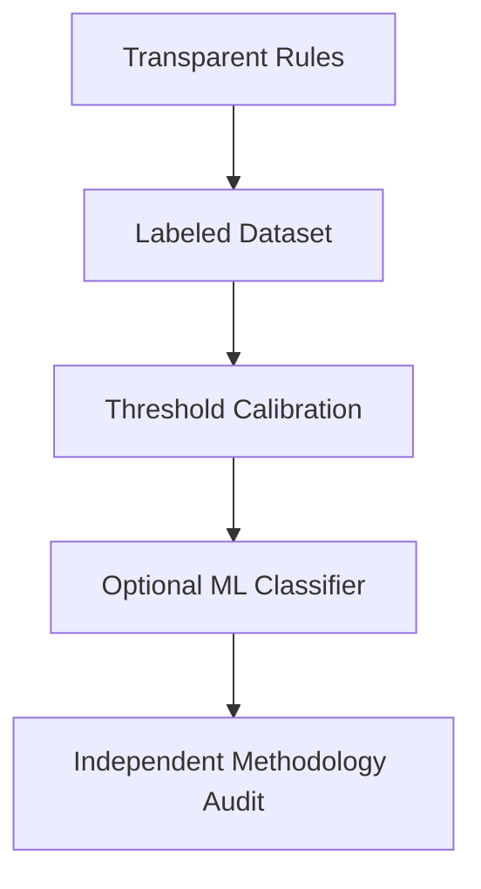

# Scoring Model

TradeGuard Shield starts with an explainable rule-based model. Machine learning can be added later once labeled datasets and review workflows exist.

## Thresholds

## Signal Weighting

## Explainability Contract

Every scoring reason must include:

- `code`
- `severity`
- `detail`
- `source`
- optional `evidenceUrl`

## Future Model Evolution

