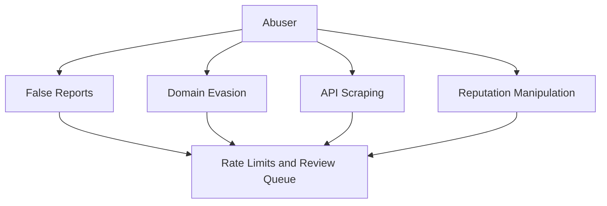

# Security Model

TradeGuard Shield handles risk intelligence and user-submitted reports, so the platform should be treated as security-sensitive.

## Threat Model

## Controls

- API rate limiting
- Evidence-backed scoring
- Report abuse detection
- Appeal and correction workflow
- Minimal browser permissions
- No storage of passwords, seed phrases, or trading credentials
- Secure handling of API keys and provider credentials

## Branch Protection Goal

The `main` branch should be protected with lightweight safeguards that do not block the owner:

- Require pull requests for non-admin contributors
- Allow administrators/owner to bypass
- Do not require status checks until CI is stable
- Prevent force pushes
- Prevent branch deletion
