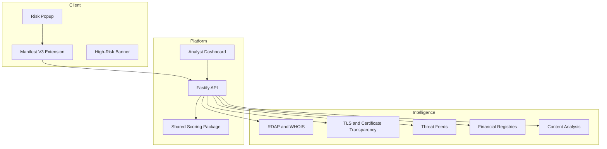

# System Overview

TradeGuard Shield combines browser-side awareness with server-side intelligence.

## Product Components

## Core Outcome

The user receives a simple result:

- Risk score from 0 to 100
- Risk level: low, medium, or high
- Badge: green, yellow, or red
- Evidence-backed reasons
- Timestamp and cache lifetime
